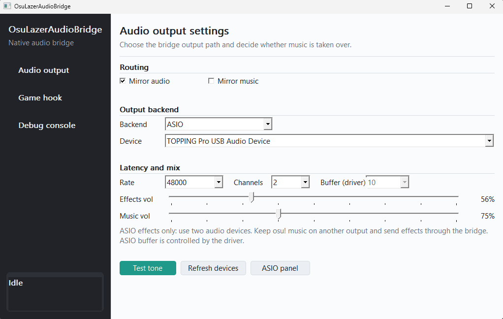

# OsuLazerAudioBridge

<p align="center">
  
</p>

OsuLazerAudioBridge is an experimental Windows audio bridge for osu!lazer. It
hooks the native BASS audio calls used by the official osu!lazer client and
mirrors selected audio output to a low-latency backend such as ASIO.

The goal is simple: keep the official game client unchanged while improving the
local audio-output path.

## Current Status

- ASIO output is the recommended path.
- Effects mirroring is the main supported use case.
- Music mirroring is available, but still experimental.
- WASAPI Exclusive is included for testing, but may still stutter on some
  devices.
- XAudio2/default output is mostly useful for comparison and debugging.

This project is not an osu! gameplay assistant. It does not implement network
behavior, input automation, judgement changes, score manipulation, overlays, or
anti-detection behavior.

## Download

Use the release zip:

```text
OsuLazerAudioBridge-v0.2.0-alpha.1-windows-x64.zip
```

Extract it to a normal folder, for example:

```text
D:\Tools\OsuLazerAudioBridge
```

The release package contains:

```text
OsuLazerAudioBridge.exe  GUI launcher
OsuLazerAudioHost.exe    audio host / injector
OsuLazerBassHook.dll     BASS hook DLL injected into osu!lazer
README_RELEASE.md        quick start and troubleshooting
LICENSE
THIRD_PARTY_NOTICES.md
```

Keep the three executable files in the same directory.

## Quick Start

1. Start osu!lazer.
2. In osu!lazer audio settings, choose an output device that will not be your
   main low-latency listening path. A silent virtual device is often useful.
3. Run `OsuLazerAudioBridge.exe`.
4. In **Audio Output**, choose `ASIO`.
5. Select your ASIO driver, for example `TOPPING Pro USB Audio Device`.
6. Set sample rate to `48000`.
7. Leave ASIO buffer as `Driver`; configure the actual buffer in your ASIO
   driver control panel.
8. Enable **Mirror audio**.
9. Enable **Mirror music** only if you want the bridge to also take over music.
10. Click Start.

Recommended first test:

- Backend: `ASIO`
- Sample rate: `48000`
- Buffer: `Driver`
- Effects volume: `100`
- Music volume: `75`
- Mirror audio: enabled
- Mirror music: disabled at first

If effects work normally, then try enabling music mirroring.

## Music Mirroring Modes

There are two practical setups.

### More Stable: Do Not Mirror Music

Use two audio devices:

- osu!lazer plays music through one device.
- OsuLazerAudioBridge mirrors effects through ASIO.

This is usually more stable because the bridge only needs to handle short sound
effects.

### One Device: Mirror Music

Enable **Mirror music** if you want both music and effects to go through the
bridge output device.

This is more convenient, but it depends more heavily on timing and buffering.
ASIO currently handles this better than WASAPI Exclusive.

## Command Line

The GUI is recommended, but the host can be run directly.

ASIO effects only:

```powershell
.\OsuLazerAudioHost.exe --process "osu!.exe" --mirror-audio --output-backend asio --output-sample-rate 48000 --output-buffer-ms 0 --effects-volume 100 --music-volume 75 --output-device "TOPPING Pro USB Audio Device" --no-log
```

ASIO effects + music:

```powershell
.\OsuLazerAudioHost.exe --process "osu!.exe" --mirror-audio --mirror-music --output-backend asio --output-sample-rate 48000 --output-buffer-ms 0 --effects-volume 100 --music-volume 75 --output-device "TOPPING Pro USB Audio Device" --no-log
```

List ASIO drivers:

```powershell
.\OsuLazerAudioHost.exe --list-asio-devices
```

Open the selected ASIO driver control panel:

```powershell
.\OsuLazerAudioHost.exe --asio-control-panel --output-backend asio --output-device "TOPPING Pro USB Audio Device"
```

Write logs for debugging:

```powershell
.\OsuLazerAudioHost.exe --process "osu!.exe" --mirror-audio --mirror-music --output-backend asio --log-dir ".\logs"
```

## Troubleshooting

### No Sound

- Make sure osu!lazer is already running before starting the bridge.
- Keep `OsuLazerAudioHost.exe` and `OsuLazerBassHook.dll` in the same folder.
- Confirm the selected ASIO driver is correct.
- Try the host test tone from the GUI or command line.

### Effects Work But Music Does Not

- Enable **Mirror music**.
- Try ASIO first. WASAPI Exclusive music mirroring is still experimental.
- Check whether osu!lazer itself is still playing music to another device.

### Distortion, Crackling, Or Stutter

- Increase the ASIO buffer in the driver control panel.
- Use `48000 Hz` if your device supports it.
- Disable music mirroring first and test effects only.
- Avoid WASAPI Exclusive for now if ASIO is available and stable.

### Very Low Volume

ASIO output volume is controlled by the app sliders and your audio interface,
not by osu!lazer's in-game volume slider.

## Build From Source

Requirements:

- Windows x64
- Visual Studio or Visual Studio Build Tools with Desktop C++ workload
- CMake
- Git

Build:

```powershell
.\scripts\build-native.ps1
```

Output:

```text
build\bin\
```

## Notes

This project is a local audio-output experiment. It injects a native DLL into
the local osu!lazer process to observe BASS audio calls and mirror audio data.
Use it at your own risk.

## License

Project source is provided under the repository license. Third-party components
retain their own licenses; see `THIRD_PARTY_NOTICES.md`.
